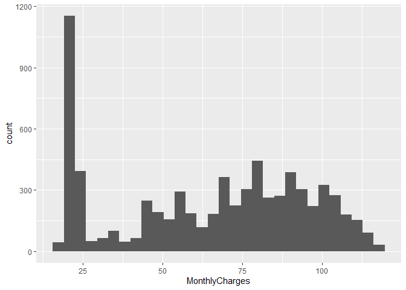

Distribuciones de frecuencias con fdth y ggplot
================
Felipe Andrés Martínez Vera
2023-03-22

# **En este cuaderno se construye una distribución de frecuencias y sus gráficos respectivos empleando fdth y ggplot**

## **1. Cargar las librerías**

Como ya se mencionó en esta ocasión se van a emplear **fdth** y
**ggplot**, lo cuales no se cargan por defecto en R.

``` r
library(tidyverse)
```

    ## ── Attaching packages ─────────────────────────────────────── tidyverse 1.3.2 ──
    ## ✔ ggplot2 3.4.0     ✔ purrr   1.0.1
    ## ✔ tibble  3.1.8     ✔ dplyr   1.1.0
    ## ✔ tidyr   1.3.0     ✔ stringr 1.5.0
    ## ✔ readr   2.1.3     ✔ forcats 1.0.0
    ## ── Conflicts ────────────────────────────────────────── tidyverse_conflicts() ──
    ## ✖ dplyr::filter() masks stats::filter()
    ## ✖ dplyr::lag()    masks stats::lag()

``` r
library(fdth)
```

    ## Warning: package 'fdth' was built under R version 4.2.3

    ## 
    ## Attaching package: 'fdth'
    ## 
    ## The following objects are masked from 'package:stats':
    ## 
    ##     sd, var

``` r
options(digits = 4, scipen = 9999)
```

Si no ha instalado las librerías debe instalarlas ejecutando lo
siguiente:

``` r
install.packages("tidyverse")
install.packages("fdth")
```

y después volver a cargar la librerías.

## 2. Importar los datos

Después de cargar la librerìas se deben importar los datos, los cuales
debieron ser subidos previamente a Colab empleando el menú de la
izquierda

    ##   customerID gender SeniorCitizen Partner Dependents tenure PhoneService
    ## 1 7590-VHVEG Female             0     Yes         No      1           No
    ## 2 5575-GNVDE   Male             0      No         No     34          Yes
    ## 3 3668-QPYBK   Male             0      No         No      2          Yes
    ## 4 7795-CFOCW   Male             0      No         No     45           No
    ## 5 9237-HQITU Female             0      No         No      2          Yes
    ## 6 9305-CDSKC Female             0      No         No      8          Yes
    ##      MultipleLines InternetService OnlineSecurity OnlineBackup DeviceProtection
    ## 1 No phone service             DSL             No          Yes               No
    ## 2               No             DSL            Yes           No              Yes
    ## 3               No             DSL            Yes          Yes               No
    ## 4 No phone service             DSL            Yes           No              Yes
    ## 5               No     Fiber optic             No           No               No
    ## 6              Yes     Fiber optic             No           No              Yes
    ##   TechSupport StreamingTV StreamingMovies       Contract PaperlessBilling
    ## 1          No          No              No Month-to-month              Yes
    ## 2          No          No              No       One year               No
    ## 3          No          No              No Month-to-month              Yes
    ## 4         Yes          No              No       One year               No
    ## 5          No          No              No Month-to-month              Yes
    ## 6          No         Yes             Yes Month-to-month              Yes
    ##               PaymentMethod MonthlyCharges TotalCharges Churn
    ## 1          Electronic check          29.85        29.85    No
    ## 2              Mailed check          56.95      1889.50    No
    ## 3              Mailed check          53.85       108.15   Yes
    ## 4 Bank transfer (automatic)          42.30      1840.75    No
    ## 5          Electronic check          70.70       151.65   Yes
    ## 6          Electronic check          99.65       820.50   Yes

# **3. Cálculo de las frecuencias absolutas y relativas**

A partir de este momento se trabajará con la variable **MonthlyCharges**
que representa el sexo de los clientes.

Para crear la tabla de frecuencias se procede de la siguiente manera:

- Se llama el objeto **datos**

- Se usa la función **pull** para extraer de la base de datos la
  variable (columna) de interés, en este caso **MonthlyCharges**

- El resultado se pasa a la función **fdt**

El resultado de este proceso debe ser guardado en una variable, a la
cual llamamos posteriormente para visualizar el resultado. **Es
necesario quitar las celdas vacias antes de pasar los datos a la función
fdt, o usar el argumenteo na.rm con valor TRUE**. A continuación se
presentan ambas opciones.

``` r
tab_freq_mont = datos %>% pull(MonthlyCharges) %>% fdt(na.rm = TRUE)
tab_freq_mont
```

    ##       Class limits    f   rf rf(%)   cf cf(%)
    ##  [18.0675,25.3439) 1505 0.21 21.18 1505 21.18
    ##  [25.3439,32.6204)  198 0.03  2.79 1703 23.96
    ##  [32.6204,39.8968)  145 0.02  2.04 1848 26.00
    ##  [39.8968,47.1732)  313 0.04  4.40 2161 30.41
    ##  [47.1732,54.4496)  410 0.06  5.77 2571 36.18
    ##  [54.4496,61.7261)  469 0.07  6.60 3040 42.77
    ##  [61.7261,69.0025)  294 0.04  4.14 3334 46.91
    ##  [69.0025,76.2789)  781 0.11 10.99 4115 57.90
    ##  [76.2789,83.5554)  592 0.08  8.33 4707 66.23
    ##  [83.5554,90.8318)  754 0.11 10.61 5461 76.84
    ##  [90.8318,98.1082)  553 0.08  7.78 6014 84.62
    ##  [98.1082,105.385)  610 0.09  8.58 6624 93.20
    ##  [105.385,112.661)  360 0.05  5.07 6984 98.27
    ##  [112.661,119.938)  122 0.02  1.72 7106 99.99

``` r
tab_freq_mont = datos %>% pull(MonthlyCharges) %>% na.omit() %>% fdt()
tab_freq_mont
```

    ##       Class limits    f   rf rf(%)   cf  cf(%)
    ##  [18.0675,25.3439) 1505 0.21 21.18 1505  21.18
    ##  [25.3439,32.6204)  198 0.03  2.79 1703  23.97
    ##  [32.6204,39.8968)  145 0.02  2.04 1848  26.01
    ##  [39.8968,47.1732)  313 0.04  4.40 2161  30.41
    ##  [47.1732,54.4496)  410 0.06  5.77 2571  36.18
    ##  [54.4496,61.7261)  469 0.07  6.60 3040  42.78
    ##  [61.7261,69.0025)  294 0.04  4.14 3334  46.92
    ##  [69.0025,76.2789)  781 0.11 10.99 4115  57.91
    ##  [76.2789,83.5554)  592 0.08  8.33 4707  66.24
    ##  [83.5554,90.8318)  754 0.11 10.61 5461  76.85
    ##  [90.8318,98.1082)  553 0.08  7.78 6014  84.63
    ##  [98.1082,105.385)  610 0.09  8.58 6624  93.22
    ##  [105.385,112.661)  360 0.05  5.07 6984  98.28
    ##  [112.661,119.938)  122 0.02  1.72 7106 100.00

Por defecto la función **fdt** usa la fórmula de Sturges
($k = 1 + 3.32*Log_{10}(N)$) para determinar el número de clases (k) y
toma como límite inferior de la primera clase en valor mínimo, y como
limite superior de la última clase el valor máximo.

Si se desea personalizar la distribución de frecuencias obtenida se
deben emplear los siguientes paráametros:

- k: permite definir el número de clases. Por ejemplo, si se define k =
  7 se obtiene una distribución de frecuencias con 7 clases. **Note que
  se conservan el límite inferior de la primera clase y el límite
  superior de la última clase, solo se modifica la amplitud de las
  clases y por lo tanto su número**

``` r
tab_freq_mont = datos %>% pull(MonthlyCharges) %>% fdt(na.rm = TRUE, k = 7)
tab_freq_mont
```

    ##       Class limits    f   rf rf(%)   cf cf(%)
    ##  [18.0675,32.6204) 1703 0.24 23.96 1703 23.96
    ##  [32.6204,47.1732)  458 0.06  6.44 2161 30.41
    ##  [47.1732,61.7261)  879 0.12 12.37 3040 42.77
    ##  [61.7261,76.2789) 1075 0.15 15.13 4115 57.90
    ##  [76.2789,90.8318) 1346 0.19 18.94 5461 76.84
    ##  [90.8318,105.385) 1163 0.16 16.36 6624 93.20
    ##  [105.385,119.938)  482 0.07  6.78 7106 99.99

Si se desea modificar los límites de la distribución de frecuencias se
deben emplear los argumentos **start** y **end**:

- start: permite definir el límite inferior de la primera clase

- end: permite definir el límite superior de la última clase. Por
  ejemplo, si se quiere que las clases vayan entre 18 y 120 se definen
  así:

Sin embargo, usar solo estos dos argumentos no permite controlar el
número de clases, este es determinado automáticametne por la función.

``` r
tab_freq_mont = datos %>% pull(MonthlyCharges) %>% fdt(na.rm = TRUE, start = 18, end = 120)
tab_freq_mont
```

    ##  Class limits    f   rf rf(%)   cf cf(%)
    ##     [18,28.1) 1618 0.23 22.77 1618 22.77
    ##   [28.1,38.2)  191 0.03  2.69 1809 25.45
    ##   [38.2,48.3)  365 0.05  5.14 2174 30.59
    ##   [48.3,58.4)  645 0.09  9.08 2819 39.67
    ##   [58.4,68.5)  482 0.07  6.78 3301 46.45
    ##   [68.5,78.6)  901 0.13 12.68 4202 59.12
    ##   [78.6,88.7)  958 0.13 13.48 5160 72.60
    ##   [88.7,98.8)  897 0.13 12.62 6057 85.23
    ##    [98.8,109)  758 0.11 10.67 6815 95.89
    ##     [109,119)  291 0.04  4.09 7106 99.99

Para modificar los límites de las distribución y controlar el número de
clases se deden emplear conjutnamente los argumentos **start**, **end**
y **h**. (Esta es la opción recomendada)

- h: permite definir la amplitud de clae (distancia entre los límites
  infrerior y superior de cada clase). se puede calcular como
  $h = \frac{\text{end - start}}{\text{No. de clases}}$.

``` r
tab_freq_mont = datos %>% pull(MonthlyCharges) %>% fdt(na.rm = TRUE, start = 18, end = 120, h = (120-18)/14)
tab_freq_mont
```

    ##  Class limits    f   rf rf(%)   cf cf(%)
    ##     [18,25.3) 1494 0.21 21.02 1494 21.02
    ##   [25.3,32.6)  209 0.03  2.94 1703 23.96
    ##   [32.6,39.9)  145 0.02  2.04 1848 26.00
    ##   [39.9,47.1)  312 0.04  4.39 2160 30.39
    ##   [47.1,54.4)  411 0.06  5.78 2571 36.18
    ##   [54.4,61.7)  469 0.07  6.60 3040 42.77
    ##     [61.7,69)  287 0.04  4.04 3327 46.81
    ##     [69,76.3)  788 0.11 11.09 4115 57.90
    ##   [76.3,83.6)  592 0.08  8.33 4707 66.23
    ##   [83.6,90.9)  759 0.11 10.68 5466 76.91
    ##   [90.9,98.1)  548 0.08  7.71 6014 84.62
    ##    [98.1,105)  616 0.09  8.67 6630 93.29
    ##     [105,113)  354 0.05  4.98 6984 98.27
    ##     [113,120)  122 0.02  1.72 7106 99.99

Al expandir los límites de la distribución de frecuencias tenga en
cuenta no hacerlos en cantidades muy grandes y hacerlo en cantidades
similares en ambos extremos.

**Los límites de las clases son presentados con un redondeo que puede
dificultar su utilización.** Para conocer estos límites usamos la
función **seq**. El argumento **from** debe ser igual al límite interior
de la primera clase, **to** debe ser igual al límite superior de la
última clase y **by** debe ser igual a h.

``` r
brks = seq(from = 18, to = 120, by = (120-18)/14)
brks
```

    ##  [1]  18.00  25.29  32.57  39.86  47.14  54.43  61.71  69.00  76.29  83.57
    ## [11]  90.86  98.14 105.43 112.71 120.00

# **4. Construccción del histograma**

Al igual que con los gráficos de barras el primer paso es la creación
del lienzo y la asignación de las variables a los ejes. En este paso se
debe tener en cuenta lo siguiente:

- **Utilizar lo datos originales** y no la distribución de frecuencias
  construida.

- La variable para la se quiere construir el histograma se asigna al eje
  x y **el eje y se deja sin variable asignada**.

``` r
ggplot(datos, aes(x = MonthlyCharges))
```

<!-- -->

A continuación se adiciona una capa **geom_histogram**. Tenga en cuenta
que por defecto se crean 30 clases.

``` r
ggplot(datos, aes(x = MonthlyCharges))+
  geom_histogram()
```

    ## `stat_bin()` using `bins = 30`. Pick better value with `binwidth`.

    ## Warning: Removed 1 rows containing non-finite values (`stat_bin()`).

<!-- -->

Para cambiar el número de clases usamos en parametro **bins** dentro de
la capa **geom_histogram**. Por ejemplo para obtener 14 clases se usa:

``` r
ggplot(datos, aes(x = MonthlyCharges))+
  geom_histogram(bins = 14)
```

    ## Warning: Removed 1 rows containing non-finite values (`stat_bin()`).

<!-- -->

El argumento **bins** ajusta el número de clases pero cambio los límites
de la distribución de frecuencias. Para lograr el histograma
correspondiente a la distribución de frecuencias que se construyó
previamente se debe utilizar el argumento **breaks** para indicar los
límites de las clase, los cuales se calcularon previamente (están
almacenados en el objeto brks).

``` r
ggplot(datos, aes(x = MonthlyCharges))+
  geom_histogram(breaks = brks, closed = "left", color = "white")
```

    ## Warning: Removed 1 rows containing non-finite values (`stat_bin()`).

<!-- -->

Finalmente se puede adicionar una cada **stat_bins** (calcula
estadísticas para cada una de las clases) para adicionar las etiquetas
que indican cuantas observaciones hay en cada clase.

``` r
ggplot(datos, aes(x = MonthlyCharges))+
  geom_histogram(breaks = brks, closed = "left", color = "white")+
  stat_bin(breaks = brks, closed = "left", geom='text', aes(label=after_stat(count)), vjust = -0.5)
```

    ## Warning: Removed 1 rows containing non-finite values (`stat_bin()`).
    ## Removed 1 rows containing non-finite values (`stat_bin()`).

<!-- -->

# **5. Construccción del polígono de frecuencias**

``` r
ggplot(datos, aes(x = MonthlyCharges))+
  geom_freqpoly(breaks = brks, closed = "left")
```

    ## Warning: Removed 1 rows containing non-finite values (`stat_bin()`).

<!-- -->
