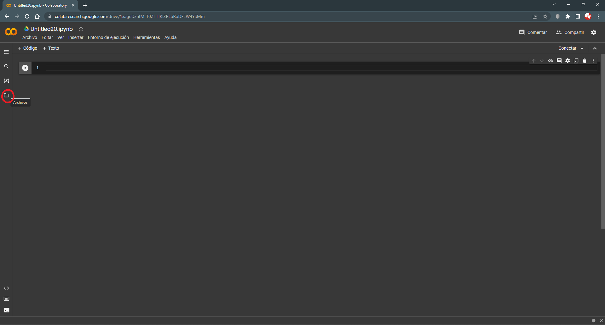

# Tablas de frecuencia con la librería dplyr de R
Felipe Andres Martínez Vera

# Crear un cuaderno nuevo

Para crear un nuevo cuaderno de **Colab** basado en R use el este link:
<https://colab.research.google.com/#create=true&language=r>

# Cargar el archivo que contiene los datos a **Colab**



# Cargar las librerias que se van a utilizar

En este caso requerimos la librería *dplyr*.

***dplyr* hace parte del paquete *tidyverese***. Al cargar *tidyverse*
se cargan 8 librerías dentro de las que se encuentra *dplyr*. Por
practicidad se prefiere cargar *tidyverse* completa en lugar de cargar
las librerías individuales.

``` r
library(tidyverse)
```

    ── Attaching packages ─────────────────────────────────────── tidyverse 1.3.2 ──
    ✔ ggplot2 3.4.0     ✔ purrr   1.0.1
    ✔ tibble  3.1.8     ✔ dplyr   1.1.0
    ✔ tidyr   1.3.0     ✔ stringr 1.5.0
    ✔ readr   2.1.3     ✔ forcats 1.0.0
    ── Conflicts ────────────────────────────────────────── tidyverse_conflicts() ──
    ✖ dplyr::filter() masks stats::filter()
    ✖ dplyr::lag()    masks stats::lag()

``` r
options(scipen = 9999)
```

# Importar los datos a R

Dado que ya cargamos el paquete *tidyverse* usaremos la función
*read_csv(){readr}* en lugar de *read.csv(){base}*. La función
*read_csv()* es mas eficiente que su homóloga del paquete “base”. Al
usar *read_csv()*, como primer argumento se debe pasar la ruta del
archivo que se desea importar.

``` r
datos = read_csv("C:/GitHub/Estadistica-I-2023-I/Tablas_de_frecuencias/Clientes_Telcomunicaciones-Churn.csv")
head(datos)
```

    # A tibble: 6 × 21
      custom…¹ gender Senio…² Partner Depen…³ tenure Phone…⁴ Multi…⁵ Inter…⁶ Onlin…⁷
      <chr>    <chr>    <dbl> <chr>   <chr>    <dbl> <chr>   <chr>   <chr>   <chr>  
    1 7590-VH… Female       0 Yes     No           1 No      No pho… DSL     No     
    2 5575-GN… Male         0 No      No          34 Yes     No      DSL     Yes    
    3 3668-QP… Male         0 No      No           2 Yes     No      DSL     Yes    
    4 7795-CF… Male         0 No      No          45 No      No pho… DSL     Yes    
    5 9237-HQ… Female       0 No      No           2 Yes     No      Fiber … No     
    6 9305-CD… Female       0 No      No           8 Yes     Yes     Fiber … No     
    # … with 11 more variables: OnlineBackup <chr>, DeviceProtection <chr>,
    #   TechSupport <chr>, StreamingTV <chr>, StreamingMovies <chr>,
    #   Contract <chr>, PaperlessBilling <chr>, PaymentMethod <chr>,
    #   MonthlyCharges <dbl>, TotalCharges <dbl>, Churn <chr>, and abbreviated
    #   variable names ¹​customerID, ²​SeniorCitizen, ³​Dependents, ⁴​PhoneService,
    #   ⁵​MultipleLines, ⁶​InternetService, ⁷​OnlineSecurity

<div>

> ****Para tener en cuenta****
>
> A partir de este momento trabajaremos con la variable “PaymentMethod”
> que indica el método de pago que utiliza el cliente. Sin embargo, los
> procedimientos aplicados pueden ser replicados con cualquier otra
> variable cualitativa.

</div>


# Obtención de las frecuencias absolutas

<div>

> **Recuerde**
>
> Frecuencia absoluta  
> La frecuencia de una clase (categoría o conjunto de valores) es el
> número de veces que la clase fue observada.

</div>

Para obtener las frecuencias de cada uno de los valores únicos de la
variable usaremos la función *count()* de la librería *dplyr*.

Al usar la función *count()* debemos indicar como primer argumento la
variable (columna) para la cual queremos obtener las frecuencias y en el
argumento *name* podremos definir el nombre de la columna que tendrá las
frecuencias absolutas. Si no se define el argumento *name* la columna
con las frecuencias aboslutas se llamará “n”.

``` r
tab_freq = datos %>%
  count(PaymentMethod, name = "fi")
tab_freq
```

Line 1  
Cargar los datos importados

Line 2  
Calcular las frecuencias absolutas

<!-- -->

    # A tibble: 5 × 2
      PaymentMethod                fi
      <chr>                     <int>
    1 Bank transfer (automatic)  1558
    2 Credit card (automatic)    1537
    3 Electronic check           2387
    4 Mailed check               1621
    5 <NA>                          4

# Obtención de las frecuencias relativas

<div>

> **Recuerde**
>
> Frecuencia relativa  
> La frecuencia relativa de una clase (categoría o conjunto de valores)
> es el número de veces que la clase fue observada dividido entre el
> total de observaciones.

</div>

Para obtener las frecuencias relativas de cada una de las clases
usaremos la función *mutate()* de la librería *dplyr*.

La función *mutate()* nos permite crear una nueva columna o modificar
una columna existente en un dataframe. Al usar *mutate()* debemos
indicar el nombre de la columna que se desea crear o modificar,
introducir el signo =, e indicar la formula que se debe emplear para
calcular el valor de esta.

``` r
tab_freq = datos %>%
  count(PaymentMethod, name = "fi") %>%
  mutate(hi = fi/sum(fi))
tab_freq
```

Line 1  
Cargar los datos importados

Line 2  
Calcular las frecuencias absolutas

Line 3  
Calcular las frecuencias relativas

<!-- -->

    # A tibble: 5 × 3
      PaymentMethod                fi       hi
      <chr>                     <int>    <dbl>
    1 Bank transfer (automatic)  1558 0.219   
    2 Credit card (automatic)    1537 0.216   
    3 Electronic check           2387 0.336   
    4 Mailed check               1621 0.228   
    5 <NA>                          4 0.000563

# Cálculo de las frecuencias acumuladas

<div>

> **Recuerde**
>
> Frecuencia absoluta acumulada  
> La frecuencia acumulada de una clase (categoría o conjunto de valo-
> res) es el número total de veces que la clase considerada, junto con
> las clases anteriores, fueron observadas.
>
> Frecuencia relativa acumulada  
> La frecuencia relativa acumulada de una clase (categoría o conjunto de
> valores) es la suma de las frecuencias relativas anteriores e
> inclusive la clase en cuestión.

</div>

Para obtener las frecuencias acumuladas de cada una de las clases
utilizaremos nuevamente la función *mutate()* de la librería *dplyr*.

``` r
tab_freq = datos %>%
  count(PaymentMethod, name = "fi") %>%
  mutate(hi = fi/sum(fi)) %>%
  mutate(Fi = cumsum(fi),
         Hi = cumsum(hi)
         )
tab_freq
```

Line 1  
Cargar los datos importados

Line 2  
Calcular las frecuencias absolutas

Line 3  
Calcular las frecuencias relativas

Lines 4-6  
Calcular las frecuencias acumuladas

<!-- -->

    # A tibble: 5 × 5
      PaymentMethod                fi       hi    Fi    Hi
      <chr>                     <int>    <dbl> <int> <dbl>
    1 Bank transfer (automatic)  1558 0.219     1558 0.219
    2 Credit card (automatic)    1537 0.216     3095 0.435
    3 Electronic check           2387 0.336     5482 0.771
    4 Mailed check               1621 0.228     7103 0.999
    5 <NA>                          4 0.000563  7107 1    

<div>

> ****Para tener en cuenta****
>
> La acumulación de las frecuencias se ve afectada por el orden que
> tengan las clases en el dataframe. Por eso antes de calcular las
> frecuencias acumuladas es necesario verificar que las clases tienen el
> orden deseado.

</div>

Ahora ordenaremos las clases por su frecuencia absoluta en orden
descendente (empezando con la clase de mayor frecuencia y terminando con
la de menor frecuencia) y volveremos a calcular las frecuencias
acumuladas.

Para ordenar el dataframe de acuerdo a los valores de la columna “fi”
utilizaremos la función *arrange()* de la librería *dplyr*.

``` r
tab_freq = datos %>%
  count(PaymentMethod, name = "fi") %>%
  mutate(hi = fi/sum(fi)) %>%
  arrange(desc(fi)) %>%
  mutate(Fi = cumsum(fi),
         Hi = cumsum(hi)
         )
tab_freq
```

Line 1  
Cargar los datos importados

Line 2  
Calcular las frecuencias absolutas

Line 3  
Calcular las frecuencias relativas

Line 4  
Ordenar la tabla de frecuencias

Lines 5-7  
Calcular las frecuencias acumuladas

<!-- -->

    # A tibble: 5 × 5
      PaymentMethod                fi       hi    Fi    Hi
      <chr>                     <int>    <dbl> <int> <dbl>
    1 Electronic check           2387 0.336     2387 0.336
    2 Mailed check               1621 0.228     4008 0.564
    3 Bank transfer (automatic)  1558 0.219     5566 0.783
    4 Credit card (automatic)    1537 0.216     7103 0.999
    5 <NA>                          4 0.000563  7107 1    

# ¡Para terminar!

1.  ¿Que orden tenían inicialmente las clases en la tabla de
    frecuencias? ¿Que orden tienen las clases en la última tabla de
    frecuencias? ¿En cuál de los dos casos tienen más significado las
    frecuencias acumuladas?

2.  Interprete los siguientes valores de la última tabla de frecuencias.

    1)  La frecuencia absoluta (fi) de la clase Mailed check
    2)  La frecuencia relativa (hi) de la clase Credit card (automatic)
    3)  La frecuencia acumulada (Fi) de la clase Bank transfer
        (automatic)
    4)  La frecuencia relativa acumulada (Hi) de la clase Bank transfer
        (automatic).
