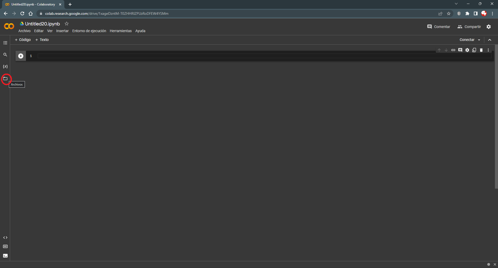

Tablas de frecuencia con el paquete base de R
================
Felipe Andres Martínez Vera

# Crear un cuaderno nuevo

Para crear un nuevo cuaderno de **Colab** basado en R use el este link:
<https://colab.research.google.com/#create=true&language=r>

# Cargar el archivo que contiene los datos a **Colab**

<figure>

<figcaption aria-hidden="true">Cargar el archivo a Colab</figcaption>
</figure>

# Cargar las librerias que se van a utilizar

En este caso la idea es trabajar con el paquete “base” de R. Por lo
tanto no se cargará ninguna librería.

# Importar los datos a R

El archivo que contiene los datos ya fue cargado a **Colab**, pero aún
no ha sido importado a R. Usaremos la funcion *read.csv()* para importar
los datos a R. Como argumento de debe pasar la ruta al archivo que se
desea importar.

``` r
datos = read.csv("C:/GitHub/Estadistica-I-2023-I/Tablas_de_frecuencias/Clientes_Telcomunicaciones-Churn.csv")

head(datos)
```

      customerID gender SeniorCitizen Partner Dependents tenure PhoneService
    1 7590-VHVEG Female             0     Yes         No      1           No
    2 5575-GNVDE   Male             0      No         No     34          Yes
    3 3668-QPYBK   Male             0      No         No      2          Yes
    4 7795-CFOCW   Male             0      No         No     45           No
    5 9237-HQITU Female             0      No         No      2          Yes
    6 9305-CDSKC Female             0      No         No      8          Yes
         MultipleLines InternetService OnlineSecurity OnlineBackup DeviceProtection
    1 No phone service             DSL             No          Yes               No
    2               No             DSL            Yes           No              Yes
    3               No             DSL            Yes          Yes               No
    4 No phone service             DSL            Yes           No              Yes
    5               No     Fiber optic             No           No               No
    6              Yes     Fiber optic             No           No              Yes
      TechSupport StreamingTV StreamingMovies       Contract PaperlessBilling
    1          No          No              No Month-to-month              Yes
    2          No          No              No       One year               No
    3          No          No              No Month-to-month              Yes
    4         Yes          No              No       One year               No
    5          No          No              No Month-to-month              Yes
    6          No         Yes             Yes Month-to-month              Yes
                  PaymentMethod MonthlyCharges TotalCharges Churn
    1          Electronic check          29.85        29.85    No
    2              Mailed check          56.95      1889.50    No
    3              Mailed check          53.85       108.15   Yes
    4 Bank transfer (automatic)          42.30      1840.75    No
    5          Electronic check          70.70       151.65   Yes
    6          Electronic check          99.65       820.50   Yes

<div>

> **Para tener en cuenta**
>
> A partir de este momento trabajaremos con la variable “PaymentMethod”
> que indica el método de pago que utiliza el cliente. Sin embargo, los
> procedimientos aplicados pueden ser replicados con cualquier otra
> variable cualitativa.

</div>

# Obtención de las frecuencias absolutas

Para obtener las frecuencias absolutas de cada uno de los valores de la
variable usamos la función *table()*. Como argumento debemos pasar la
columna (o variable) de la cual queremos calcular las frecuencias.

<div>

> **Importante**
>
> Para referirnos a una columna de un dataframe empleamos la siguiente
> estructura: *“nombre del data frame”\$“nombre de la columna”*, en este
> caso *datos\$PaymentMethod*.

</div>

``` r
freq_abs = table(datos$PaymentMethod)
freq_abs
```


                              Bank transfer (automatic)   Credit card (automatic) 
                            4                      1558                      1537 
             Electronic check              Mailed check 
                         2387                      1621 

Los resultados muestran que la clase “Bank transfer (automatic)” tiene
una frecuencia de 1558, la clase “Credit card (automatic)” tiene una
frecuencia de 1537, la clase “Electronic check” tiene una frecuencia de
2387, la clase “Mailed check” tiene una frecuencia de 1621.

# Obtención de las frecuencias relativas

Para obtener las frecuencias relativas de cada una de las clases usamos
la función *prop.table()*. Como argumento debemos pasar la tabla de
frecuencias absolutas obtenida en el paso anterior.

``` r
freq_rels = prop.table(freq_abs)
freq_rels
```


                              Bank transfer (automatic)   Credit card (automatic) 
                 0.0005628254              0.2192204868              0.2162656536 
             Electronic check              Mailed check 
                 0.3358660476              0.2280849866 

Los resultados muestran que la clase “Bank transfer (automatic)” tiene
una frecuencia relativa de 0.2192, la clase “Credit card (automatic)”
tiene una frecuencia relativa de 0.2163, la clase “Electronic check”
tiene una frecuencia relativa de 0.3359, la clase “Mailed check” tiene
una frecuencia relativa de 0.2281.

<div>

> **Recuerde**
>
> Si se multiplica la frecuencias relativa de una clase por 100 se
> obtiene el porcentaje (%) de observaciones que pertenecen a ella. Por
> ejemplo, la clase “Bank transfer (automatic)” tiene una frecuencia
> relativa de 0.2192, por lo que podemos concluir que el 21.92% de las
> observaciones pertenecen a esta clase.

</div>

# Ensamble de la tabla de frecuencias completa

Para obtener la tabla de frecuencias en una dataframe (formato similar a
una hoja de EXCEL, con filas y columnas) usaremos la función
*data.frame()*. Pasaremos como argumento cada uno de los productos de
los pasos anteriores.

``` r
tab_freq = data.frame("clases" = names(freq_abs),
                      "fi" = as.integer(freq_abs),
                      "hi" = round(as.double(freq_rels),4))
tab_freq
```

                         clases   fi     hi
    1                              4 0.0006
    2 Bank transfer (automatic) 1558 0.2192
    3   Credit card (automatic) 1537 0.2163
    4          Electronic check 2387 0.3359
    5              Mailed check 1621 0.2281

<div>

> **Importante**
>
> 1.  Note que antes de cada objeto hay un nombre entre comillas. Ese es
>     el nombre que se le asignará a la columna donde de guarden estos
>     valores.
> 2.  Note que para las clases se usa la función *as.integer()* y el
>     objeto *freq_abs*. Esta función asegura que se quitan los valores
>     asociados a cada categoria y se conservan solo los nombres.
>
> ``` r
> names(freq_abs)
> ```
>
>     [1] ""                          "Bank transfer (automatic)"
>     [3] "Credit card (automatic)"   "Electronic check"         
>     [5] "Mailed check"             
>
> 3.  Note que junto al objeto *freq_abs* se usa la función
>     *as.integer()*. Esta función asegura que se quitan los nombres
>     asociados a los valores y estos de guardan como números enteros.
>
> ``` r
> as.integer(freq_abs)
> ```
>
>     [1]    4 1558 1537 2387 1621
>
> 4.  Note que junto al objeto *freq_rels* se usa la función
>     *as.double()*. Esta función asegura que se quitan los nombres
>     asociados a los valores y estos de guardan como números con
>     decimales.
>
> ``` r
> as.double(freq_rels)
> ```
>
>     [1] 0.0005628254 0.2192204868 0.2162656536 0.3358660476 0.2280849866

</div>

# Cálculo de las frecuencias acumuladas

<div>

> **Recuerde**
>
> La acumulación de las frecuencias se ve afectada por el orden que
> tengan las clases en el dataframe. Por eso antes de calcular las
> frecuencias acumuladas es necesario verificar que las clases tienen el
> orden deseado.

</div>

Para agregar las frecuencias acumuladas crearemos nuevas columnas en el
dataframe y usaremos la función *cumsum()* para asignar los valores.
$$tab\\_freq\$Fi = cumsum(tab\\_freq\$fi)$$
$$tab\\_freq\$Hi = cumsum(tab\\_freq\$hi)$$

``` r
tab_freq$Fi = cumsum(tab_freq$fi)
tab_freq$Hi = cumsum(tab_freq$hi)
tab_freq
```

                         clases   fi     hi   Fi     Hi
    1                              4 0.0006    4 0.0006
    2 Bank transfer (automatic) 1558 0.2192 1562 0.2198
    3   Credit card (automatic) 1537 0.2163 3099 0.4361
    4          Electronic check 2387 0.3359 5486 0.7720
    5              Mailed check 1621 0.2281 7107 1.0001

Ahora vamos a ordenar las clases por su frecuencia absoluta en orden
descendente (empezando con la clase de mayor frecuencia y terminando con
la de menor frecuencia) y volveremos a calcular las frecuencias
acumuladas.

``` r
tab_freq = tab_freq[order(tab_freq$fi, decreasing = TRUE),]
tab_freq$Fi = cumsum(tab_freq$fi)
tab_freq$Hi = cumsum(tab_freq$hi)
tab_freq
```

                         clases   fi     hi   Fi     Hi
    4          Electronic check 2387 0.3359 2387 0.3359
    5              Mailed check 1621 0.2281 4008 0.5640
    2 Bank transfer (automatic) 1558 0.2192 5566 0.7832
    3   Credit card (automatic) 1537 0.2163 7103 0.9995
    1                              4 0.0006 7107 1.0001

# ¡Para terminar!

1.  ¿Que orden tenían inicialmente las clases en la tabla de
    frecuencias? ¿Que orden tienen las clases en la última tabla de
    frecuencias? ¿En cuál de los dos casos tienen más significado las
    frecuencias acumuladas?

2.  Interprete los siguientes valores de la última tabla de frecuencias.

    1)  La frecuencia absoluta (fi) de la clase Mailed check
    2)  La frecuencia relativa (hi) de la clase Credit card (automatic)
    3)  La frecuencia acumulada (Fi) de la clase Bank transfer
        (automatic)
    4)  La frecuencia relativa acumulada (Hi) de la clase Bank transfer
        (automatic).
