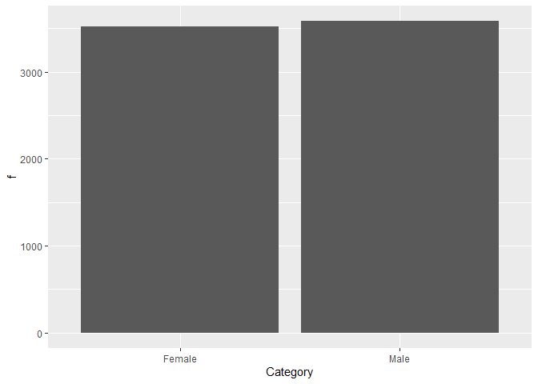
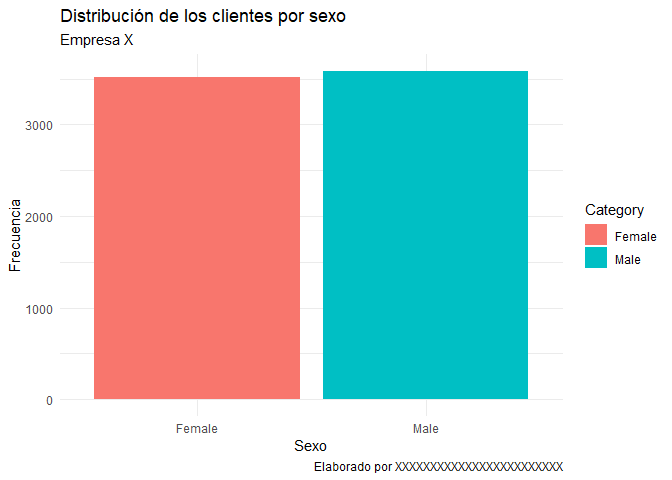

Tablas de frecuencias con fdth y ggplot
================
Felipe Andrés Martínez Vera
2023-03-22

# **En este cuaderno se construye una tabla de frecuencias y sus respectivos gráficos de barras y de pastel empleando fdth y ggplot**

## **1. Cargar las librerías**

Como ya se mencionó en esta ocasión se van a emplear **fdth** y
**ggplot**, lo cuales no se cargan por defecto en R.

``` r
library(tidyverse)
```

    ## ── Attaching packages ─────────────────────────────────────── tidyverse 1.3.2 ──
    ## ✔ ggplot2 3.4.0     ✔ purrr   1.0.1
    ## ✔ tibble  3.1.8     ✔ dplyr   1.1.0
    ## ✔ tidyr   1.3.0     ✔ stringr 1.5.0
    ## ✔ readr   2.1.3     ✔ forcats 1.0.0
    ## ── Conflicts ────────────────────────────────────────── tidyverse_conflicts() ──
    ## ✖ dplyr::filter() masks stats::filter()
    ## ✖ dplyr::lag()    masks stats::lag()

``` r
library(fdth)
```

    ## Warning: package 'fdth' was built under R version 4.2.3

    ## 
    ## Attaching package: 'fdth'
    ## 
    ## The following objects are masked from 'package:stats':
    ## 
    ##     sd, var

Si no ha instalado las librerías debe instalarlas ejecutando lo
siguiente:

``` r
install.packages("tidyverse")
install.packages("fdth")
```

y después volver a cargar la librerías.

## 2. Importar los datos

Después de cargar la librerías se deben importar los datos, los cuales
debieron ser subidos previamente a Colab empleando el menú de la
izquierda

    ##   customerID gender SeniorCitizen Partner Dependents tenure PhoneService
    ## 1 7590-VHVEG Female             0     Yes         No      1           No
    ## 2 5575-GNVDE   Male             0      No         No     34          Yes
    ## 3 3668-QPYBK   Male             0      No         No      2          Yes
    ## 4 7795-CFOCW   Male             0      No         No     45           No
    ## 5 9237-HQITU Female             0      No         No      2          Yes
    ## 6 9305-CDSKC Female             0      No         No      8          Yes
    ##      MultipleLines InternetService OnlineSecurity OnlineBackup DeviceProtection
    ## 1 No phone service             DSL             No          Yes               No
    ## 2               No             DSL            Yes           No              Yes
    ## 3               No             DSL            Yes          Yes               No
    ## 4 No phone service             DSL            Yes           No              Yes
    ## 5               No     Fiber optic             No           No               No
    ## 6              Yes     Fiber optic             No           No              Yes
    ##   TechSupport StreamingTV StreamingMovies       Contract PaperlessBilling
    ## 1          No          No              No Month-to-month              Yes
    ## 2          No          No              No       One year               No
    ## 3          No          No              No Month-to-month              Yes
    ## 4         Yes          No              No       One year               No
    ## 5          No          No              No Month-to-month              Yes
    ## 6          No         Yes             Yes Month-to-month              Yes
    ##               PaymentMethod MonthlyCharges TotalCharges Churn
    ## 1          Electronic check          29.85        29.85    No
    ## 2              Mailed check          56.95      1889.50    No
    ## 3              Mailed check          53.85       108.15   Yes
    ## 4 Bank transfer (automatic)          42.30      1840.75    No
    ## 5          Electronic check          70.70       151.65   Yes
    ## 6          Electronic check          99.65       820.50   Yes

# **3. Cálculo de las frecuencias absolutas y relativas**

A partir de este momento se trabajará con la variable **gender** que
representa el sexo de los clientes.

Para crear la tabla de frecuencias se procede de la siguiente manera:

- Se llama el objeto **datos**

- Se usa la función **pull** para extraer de la base de datos la
  variable (columna) de interés, en este caso **gender**

- El resultado se pasa a la función **fdt_cat**

El resultado de este proceso debe ser guardado en una variable, a la
cual llamamos posteriormente para visualizar el resultado.

``` r
tab_freq_sex = datos %>% pull(gender) %>% fdt_cat()
tab_freq_sex
```

    ##  Category    f  rf rf(%)   cf  cf(%)
    ##      Male 3585 0.5 50.44 3585  50.44
    ##    Female 3522 0.5 49.56 7107 100.00

A través de este procedimiento se obtiene la tabla de frecuencias
ensamblada.

## **3. Construcción de los gráficos de barras**

A continuación se se construirán los gráficos de barras, de frecuencias
absolutas y relativas, de la variable **gender** empleando el paquete
**ggplot**.

### **3.1 Usando geom_col**

La función **ggplot** crea el lienzo sobre el cual se va a construir la
gráfica. El primer argumento corresponde a los datos que se van a
utilizar para elaborar el gráfico (tab_freq_sex en este caso) y dentro
de argumento **aes** (estéticas) se asignan las variables a los ejes.

``` r
ggplot(tab_freq_sex, aes(x = Category, y = f))
```

<!-- -->

Sobre el lienzo se adicionan las demás capas, la primera de ellas será
una capa **geom_col**. Esta capa hereda las variables asociadas a cada
eje del lienzo, por lo tanto no es necesario definir estéticas para la
capa.

``` r
ggplot(tab_freq_sex, aes(x = Category, y = f)) +
  geom_col()
```

<!-- -->

La capa **labs** permite modificar los títulos de los ejes, agregar el
título y subtitulo al gráfico y poner un texto de adicional.

``` r
ggplot(tab_freq_sex, aes(x = Category, y = f)) +
  geom_col()+
  labs(x = "Sexo",
        y = "Frecuencia",
        title = "Distribución de los clientes por sexo",
        subtitle = "Empresa X",
        caption = "Elaborado por XXXXXXXXXXXXXXXXXXXXXXXX")
```

<!-- -->

Para cambiar el color de las barras se debe emplar el argumento
**fill**. Si se desea asignar el mismo color a todas las columnas se usa
como argumento de la función **geom_col**.

``` r
ggplot(tab_freq_sex, aes(x = Category, y = f)) +
  geom_col(fill = "darkgreen")+
  labs(x = "Sexo",
        y = "Frecuencia",
        title = "Distribución de los clientes por sexo",
        subtitle = "Empresa X",
        caption = "Elaborado por XXXXXXXXXXXXXXXXXXXXXXXX")
```

<!-- -->

Si se desea asignar un color especifico a cada clase, el argumento
**fill** se utiliza de la misma manera, solo que se ingresa una lista de
colores. **La lista debe tener tantos colores como clases tenga la tabla
de frecuencias.**

``` r
ggplot(tab_freq_sex, aes(x = Category, y = f)) +
  geom_col(fill = c("blue", "pink"))+
  labs(x = "Sexo",
        y = "Frecuencia",
        title = "Distribución de los clientes por sexo",
        subtitle = "Empresa X",
        caption = "Elaborado por XXXXXXXXXXXXXXXXXXXXXXXX")
```

<!-- -->

<span style="color:red">**Observe la relación entre el orden de las
categorías en la tabla de frecuencias y el orden que tienen en la
gráfica**</span>.

Si se desea que el color dependa de la clase, el argumento **fill** se
utiliza dentro de las estéticas (aes) del **gráfico** o de la capa
**geom_col**.

``` r
### En las estéticas del gráfico
ggplot(tab_freq_sex, aes(x = Category, y = f, fill = Category)) +
  geom_col()+
  labs(x = "Sexo",
        y = "Frecuencia",
        title = "Distribución de los clientes por sexo",
        subtitle = "Empresa X",
        caption = "Elaborado por XXXXXXXXXXXXXXXXXXXXXXXX")
```

<!-- -->

``` r
### En las estéticas de la capa geom_col
ggplot(tab_freq_sex, aes(x = Category, y = f)) +
  geom_col(aes(fill = Category))+
  labs(x = "Sexo",
        y = "Frecuencia",
        title = "Distribución de los clientes por sexo",
        subtitle = "Empresa X",
        caption = "Elaborado por XXXXXXXXXXXXXXXXXXXXXXXX")
```

<!-- -->

ggplot ofrece varios temas (theme) que cambian la apariencia de los
gráficos. Pruebe las opciones disponibles.

``` r
### En las estéticas de la capa geom_col
ggplot(tab_freq_sex, aes(x = Category, y = f, fill = Category)) +
  geom_col()+
  labs(x = "Sexo",
        y = "Frecuencia",
        title = "Distribución de los clientes por sexo",
        subtitle = "Empresa X",
        caption = "Elaborado por XXXXXXXXXXXXXXXXXXXXXXXX") +
  theme_dark()
```

<!-- -->

``` r
### En las estéticas de la capa geom_col
ggplot(tab_freq_sex, aes(x = Category, y = f, fill = Category)) +
  geom_col()+
  labs(x = "Sexo",
        y = "Frecuencia",
        title = "Distribución de los clientes por sexo",
        subtitle = "Empresa X",
        caption = "Elaborado por XXXXXXXXXXXXXXXXXXXXXXXX") +
  theme_minimal()
```

<!-- -->

**Para elaborar el gráfico de barras de frecuencias relativas se debe
cambiar la variable asignada al eje y**. En este caso se debe asignar
**rf** en lugar de **f**.

## **4. Construcción del gráfico de torta o pastel**

A continuación se se construirá el gráfico de torta o pastes de la
variable **gender** empleando el paquete **ggplot**.

### **4.1 Usando geom_col y coord_polar**

Para elaborar un gráfico de torta o paste de parte de un gráfico de
barras sin variable asignada al eje x.

``` r
ggplot(tab_freq_sex, aes(x = "", y = f, fill = Category)) +
  geom_col(linewidth = 1, color = "white", width = 1)+
  labs(title = "Distribución de los clientes por sexo",
        subtitle = "Empresa X",
        caption = "Elaborado por XXXXXXXXXXXXXXXXXXXXXXXX",
        fill = "Sexo")
```

<!-- -->

A este gráfico se le cambia el sistema de coordenadas de cartesianas a
polares, adicionando una capa **coord_polar** y especificando que se
desea convertir el eje **y**

``` r
ggplot(tab_freq_sex, aes(x = "", y = f, fill = Category)) +
  geom_col(linewidth = 1, color = "white", width = 1)+
  labs(title = "Distribución de los clientes por sexo",
        subtitle = "Empresa X",
        caption = "Elaborado por XXXXXXXXXXXXXXXXXXXXXXXX",
        fill = "Sexo")+
  coord_polar("y")
```

<!-- -->

Por último se adicionan la etiquetas empleando una capa **geom_text** y
se cambia el tema para eliminar los elemento de los ejes.

``` r
ggplot(tab_freq_sex, aes(x = "", y = f, fill = Category)) +
  geom_col(linewidth = 1, color = "white", width = 1)+
  labs(title = "Distribución de los clientes por sexo",
        subtitle = "Empresa X",
        caption = "Elaborado por XXXXXXXXXXXXXXXXXXXXXXXX",
        fill = "Sexo")+
  coord_polar("y")+
  theme_void()+
  geom_text(aes(label = f),
            position = position_stack(vjust = 0.5),
            show.legend = FALSE,
            size = 6)
```

<!-- -->
