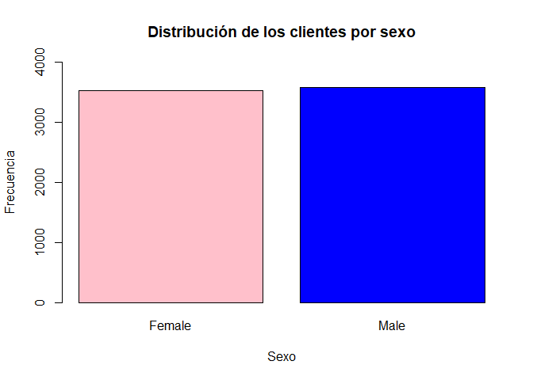
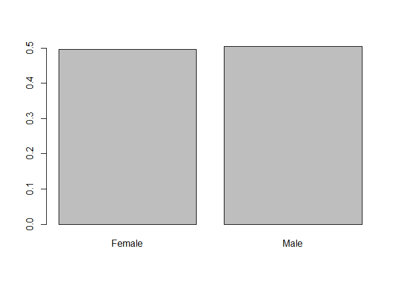
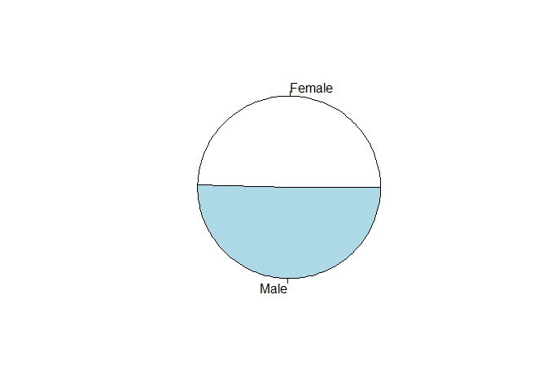
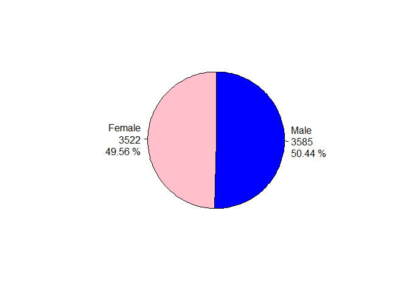

Tablas de frecuencias con el paquete base de R
================
Felipe Andrés Martínez Vera
2023-03-22

# En este cuaderno se construye una tabla de frecuencias y sus respectivos gráficos de barras y de pastel empleando el paquete base de R

En este caso no se cargará ninguna librería, solo se utilizarán las
funciones del paquete base de R

## 1. Importar los datos

Inicialmente se deben importar los datos, los cuales debieron ser
subidos previamente a Colab empleando el menú de la izquierda

    ##   customerID gender SeniorCitizen Partner Dependents tenure PhoneService
    ## 1 7590-VHVEG Female             0     Yes         No      1           No
    ## 2 5575-GNVDE   Male             0      No         No     34          Yes
    ## 3 3668-QPYBK   Male             0      No         No      2          Yes
    ## 4 7795-CFOCW   Male             0      No         No     45           No
    ## 5 9237-HQITU Female             0      No         No      2          Yes
    ## 6 9305-CDSKC Female             0      No         No      8          Yes
    ##      MultipleLines InternetService OnlineSecurity OnlineBackup DeviceProtection
    ## 1 No phone service             DSL             No          Yes               No
    ## 2               No             DSL            Yes           No              Yes
    ## 3               No             DSL            Yes          Yes               No
    ## 4 No phone service             DSL            Yes           No              Yes
    ## 5               No     Fiber optic             No           No               No
    ## 6              Yes     Fiber optic             No           No              Yes
    ##   TechSupport StreamingTV StreamingMovies       Contract PaperlessBilling
    ## 1          No          No              No Month-to-month              Yes
    ## 2          No          No              No       One year               No
    ## 3          No          No              No Month-to-month              Yes
    ## 4         Yes          No              No       One year               No
    ## 5          No          No              No Month-to-month              Yes
    ## 6          No         Yes             Yes Month-to-month              Yes
    ##               PaymentMethod MonthlyCharges TotalCharges Churn
    ## 1          Electronic check          29.85        29.85    No
    ## 2              Mailed check          56.95      1889.50    No
    ## 3              Mailed check          53.85       108.15   Yes
    ## 4 Bank transfer (automatic)          42.30      1840.75    No
    ## 5          Electronic check          70.70       151.65   Yes
    ## 6          Electronic check          99.65       820.50   Yes

## 2. Cálculo de las frecuencias absolutas y relativas

A partir de este momento se trabajará con la variable **gender** que
representa el sexo de los clientes.

La función ***table*** calcula las frecuencias absolutas de cada una de
las categorías de la variable que le se entregada como argumento.

La función ***prop.table*** calcula las frecuencias relativas de cada
una de las categorías encontradas en la tabla de frecuencias absolutas
que se le pase como argumento

``` r
freq_sex = table(datos$gender)
freq_sex
```

    ## 
    ## Female   Male 
    ##   3522   3585

``` r
freq_rel_sex = prop.table(freq_sex)
freq_rel_sex
```

    ## 
    ##    Female      Male 
    ## 0.4955678 0.5044322

Tenga en cuenta que las tablas de frecuencias absolutas y relativas
están guardadas en objetos llamados **freq_sex** y **freq_rel_sex**
respectivamente. Estos objetos será usados en más adelante.

## **3. Ensamble de la tabla de frecuencias completa**

En este momento se tienen dos vectores nombrados, una con las
frecuencias absolutas y otra con las frecuencias relativas, ahora se
construirá una estructura tabular (filas y columnas) a partir de las
listas.

``` r
tab_freq_sex = data.frame("Sexo" = names(freq_sex), "fi" = as.integer(freq_sex), "hi" = as.double(freq_rel_sex))
tab_freq_sex
```

    ##     Sexo   fi        hi
    ## 1 Female 3522 0.4955678
    ## 2   Male 3585 0.5044322

## **4. Construcción de los gráficos de barras**

A continuaciónse se construirán los gráficos de barras, de frecuencias
absolutas y relativas, de la variable **gender**

### **4.1 A partir de los objetos table y prop.table**

Al emplear la función ***barplot*** con **freq_sex** como argumento, se
obtiene el gráfico de barras de frecuencias absolutas.

``` r
barplot(freq_sex)
```

<!-- -->

Los siguientes argumentos de la función ***barplot*** permiten
personaliza el gráfico:

**main**: adiciona el título de la gráfica,

**xlab**: adiciona el tìtulo del eje x,

**ylab**: adiciona el título del eje y,

**ylim**: modifica los límites del eje y,

**xlim**: modifica los límites del eje x,

**col**: modifica el color de la barras. Se puede definir un color para
todas las barras o uno para cada barra. **Si se desea dar colores
diferentes a las barras se deben especificar tantos colores como clases
tenga la Tabla de Frecuencias**\*

``` r
barplot(freq_sex,
         main = "Distribución de los clientes por sexo", # adiciona el tiutulo de la gráfica
         xlab = "Sexo", # adiciona el titulo del eje x
         ylab = "Frecuencia", #adiciona el titulo del eje y
         ylim = c(0, 4000), # modifica los limites del eje y
         col = c("pink", "blue")
         )
```

<!-- -->

Si la función ***barplot*** se utiliza con **freq_rel_sex** como
argumento, se obtiene el gráfico de barras de frecuencias relativa.

``` r
barplot(freq_rel_sex)
```

<!-- -->

**Note que los dos gráficos anteriores tienen la misma forma.** La
diferencia está en que el gráfico de frecuencias absolutas el eje y
representa la cantidad de clientes de cada sexo, mientras qjue el
gráfico de frecuencias relativas este eje representa la proporción de
clientes de cada sexo.

<b style = 'color : red;'>En la gráfica de frecuencias absolutas las
alturas de las barras representan la cantidad de individuos que
pertenecen a la clase, mientras que en el gráfico de frecuencias
relativa las alturas de las barras representa la proporción de
individuos que pertenecen a la clase.</b>

En ambos gráficos se pueden emplear los argumentos para personalizar la
apariencia del gráfico.

### **4.2 A partir de la tabla de frecuencias ensamblada**

Si se quiere construir el gráfico de frecuencias absolutas a partir de
la tabla de frecuencias ensamblada, se debe indicar como primer
argumento la columna del data.frame que contiene las frecuencias y
adicionar el argumento **names.arg** indicando la columna que contiene
los nombres de la clases.

**Para indicar una columna de un data.frame se especifica el nombre del
data.frame el signo \$ y el nombre de la columna.**

``` r
barplot(tab_freq_sex$fi, names.arg = tab_freq_sex$Sexo)
```

<!-- -->

Si se cambia el primer argumento de la función ***barplot*** por la
columna del data.frame que contiene las frecuencias relativas y se
mantiene argumento **names.arg** indicando la columna que contiene los
nombres de la clases, se obtiene el gráfico de barras de las frecuencias
relativas.

``` r
barplot(tab_freq_sex$hi, names.arg = tab_freq_sex$Sexo)
```

<!-- -->

En cualquiera de estos dos gráficos también se pueden emplear los
argumentos para personalizar la apariencia.

## **5. Construcción del gráfico de torta o pastel**

Por último se construirá el gráfico de torta o paste de la variable
**gender**

### **5.1 A partir de los objetos table y prop.table**

Al emplear la función ***pie*** con **freq_sex** o **freq_rel_sex** como
argumento, se obtiene el gráfico de torta o pastel de la variable
**gender**.

``` r
pie(freq_sex)
```

<!-- -->

``` r
pie(freq_rel_sex)
```

<!-- -->

Note que el gráfico obtenido es el mismo independientemente de si se una
**freq_sex** o **freq_rel_sex**.

En un gráfico de torta o pastel el ángulo de la sección angular que
corresponde a cada categoría depende de la frecuencia relativa de esta.
Por ejemplo su una categoría tiene una frecuencia relativa de 0.4955678,
el ángulo de la sección angular que le corresponde es de
$θ = 360*0.4955678 = 178.40^{o}$.

### **5.2 A partir de la tabla de frecuencias ensamblada**

Para construir el gráfico de torta o pastel a partir de la tabla de
frecuencias ensamblada en formato tabular se utiliza la función
***pie***, pasando como primer argumento la columna del data.frame que
contiene las frecuencias (pueden ser la frecuencias absolutas o las
frecuencias relativas) y luego el argumento **labels** indicando la
columna del data.frame que contiene los nombres de las clases.

``` r
pie(tab_freq_sex$hi, labels= tab_freq_sex$Sexo)
```

<!-- -->

Finalmente, para darle mayor claridad al gráfico se suelen modificar las
etiquetas y los colores de las secciones. Para esto se usan los
siguientes argumentos:

**labels:** permite modificar la etiqueta de cada uno de las clases. *En
el ejemplo se adicionará el número de clientes y la proporción que
representan.*

**col:** permite modificar los colores. *Tenga en cuenta que se deben
especificar tantos colores como clases existan.*

**init.angle:** permite especificar donde inicia la primera sección.
*por defecto la primera sección circular inicia en el segmento positivo
del eje x.*

``` r
pie(freq_sex,
    labels = paste(names(freq_sex), as.integer(freq_sex), paste(round(as.double(freq_rel_sex)*100,2),"%"), sep = "\n"),
    col = c("pink", "blue"), # se asigna un color a cada clase.
    init.angle = 90,)
```

<!-- -->
